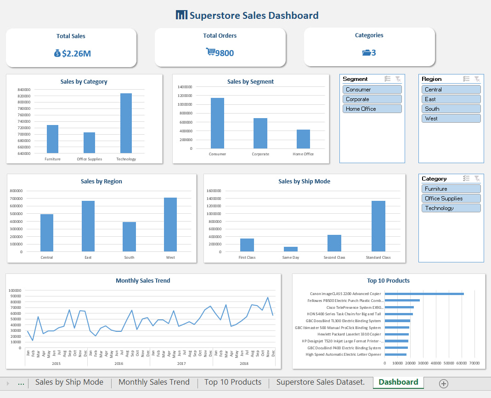

# 📊 Superstore Sales Analysis



## Overview

This project presents an interactive sales dashboard created in Microsoft Excel using the Superstore Sales dataset.

The purpose of this project was to transform raw sales data into meaningful business insights through data cleaning, analysis, and visualization.

The dashboard provides an overview of sales performance, customer segments, product categories, shipping methods, and monthly trends to support data-driven decision-making.

---

## Business Objectives

The main objectives of this project were:

- Analyze overall sales performance
- Identify top-performing product categories
- Understand customer purchasing patterns
- Evaluate shipping method performance
- Track monthly sales trends
- Identify the Top 10 products by revenue

---

## Dataset Information

- **Dataset:** Superstore Sales Dataset
- **Format:** Microsoft Excel (.xlsx)
- **Records:** 9,800
- **Columns:** 18

---

## Key Metrics

| Metric | Value |
|---|---:|
| Total Sales | $2.26M |
| Total Orders | 9,800 |
| Product Categories | 3 |

---

## Tools & Skills

### Microsoft Excel

- Data Cleaning
- Pivot Tables
- Pivot Charts
- Slicers
- Conditional Formatting
- Dashboard Development
- Data Visualization
- Business Reporting

---

## Dashboard Features

The dashboard includes:

- 📈 Total Sales KPI
- 📦 Total Orders KPI
- 🗂 Category Analysis
- 👥 Customer Segment Analysis
- 🚚 Shipping Mode Analysis
- 📅 Monthly Sales Trend
- 🏆 Top 10 Products Analysis

---

## Key Insights

Based on the analysis:

- Technology generated the highest sales among all product categories.
- Consumer customers contributed the largest share of total revenue.
- Standard Class was the most commonly used shipping method.
- Sales performance changed throughout the year, showing seasonal patterns.
- A limited number of products contributed significantly to overall revenue.

---

## Project Structure

```
Sales-Analysis
│
├── Data
│   └── Superstore_Sales_Dataset.xlsx
│
├── Dashboard
│   └── Superstore_Sales_Dashboard.xlsx
│
├── Screenshots
│   └── dashboard.png
│
├── Documentation
│
└── README.md
```

---

## Learning Outcomes

Through this project, I improved my skills in:

- Cleaning and preparing raw datasets
- Creating interactive Excel dashboards
- Building business-focused visualizations
- Extracting insights from sales data
- Presenting analytical findings clearly

---

## Author

**Sevinch Boltakova**

Junior Data Analyst

GitHub Portfolio Project