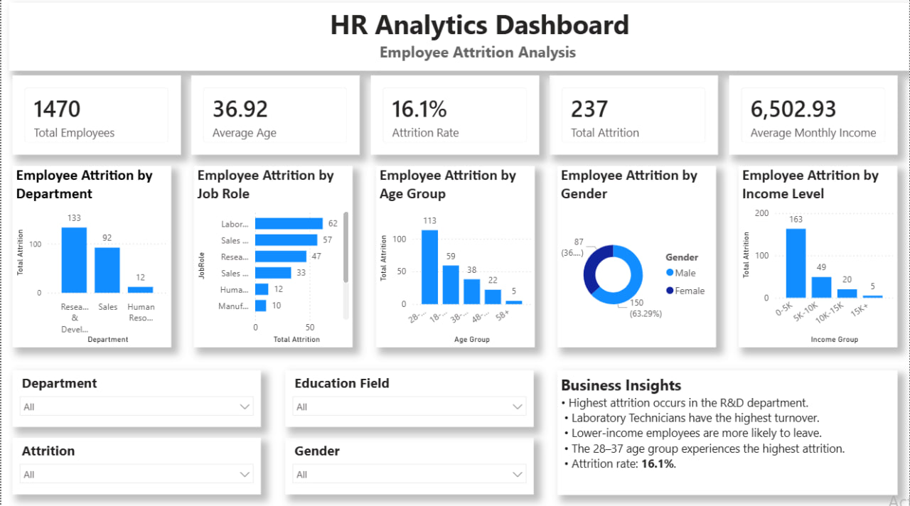

# HR Analytics Dashboard

## 📌 Project Overview

This project presents an interactive HR Analytics Dashboard built in Power BI to analyze employee attrition and workforce trends. The dashboard helps HR professionals identify key factors affecting employee turnover and supports data-driven decision-making.

---

## 🎯 Business Problem

High employee attrition can increase recruitment costs, reduce productivity, and impact overall business performance. This dashboard analyzes employee attrition across departments, job roles, age groups, gender, and income levels to identify high-risk areas.

---

## 📊 Dataset

- **Dataset:** IBM HR Analytics Employee Attrition & Performance
- **Source:** Kaggle
- **Records:** 1,470 Employees

---

## 🛠 Tools & Technologies

- Power BI
- Power Query
- DAX
- Data Visualization

---

## 📈 Dashboard Features

- KPI Cards
- Employee Attrition by Department
- Employee Attrition by Job Role
- Employee Attrition by Age Group
- Employee Attrition by Gender
- Employee Attrition by Income Level
- Interactive Slicers
- Business Insights

---

## 📊 Key Performance Indicators (KPIs)

| KPI | Value |
|------|------:|
| Total Employees | 1,470 |
| Average Age | 36.92 |
| Attrition Rate | 16.1% |
| Total Attrition | 237 |
| Average Monthly Income | 6,503 |

---

## 📷 Dashboard Preview



---

## 💡 Business Insights

- Research & Development has the highest employee attrition.
- Laboratory Technicians experience the highest employee turnover.
- Employees earning **0–5K** have the highest attrition.
- Employees aged **28–37** represent the largest attrition group.
- The overall employee attrition rate is **16.1%**.

---

## ✅ Recommendations

- Improve retention strategies in the Research & Development department.
- Review compensation and career development opportunities for lower-income employees.
- Strengthen employee engagement for the 28–37 age group.
- Monitor attrition trends using HR analytics dashboards.

---

## 📁 Project Structure

```text
HR-Analytics-Dashboard
│
├── README.md
├── HR_Analytics_Dashboard.pbix
├── dataset
│   └── WA_Fn-UseC_-HR-Employee-Attrition.csv
└── screenshots
    └── dashboard.png
```

---

## 🎯 Skills Demonstrated

- Data Cleaning
- Data Modeling
- DAX Measures
- Interactive Dashboard Design
- KPI Development
- HR Analytics
- Data Visualization
- Business Insight Generation
- Data Storytelling
