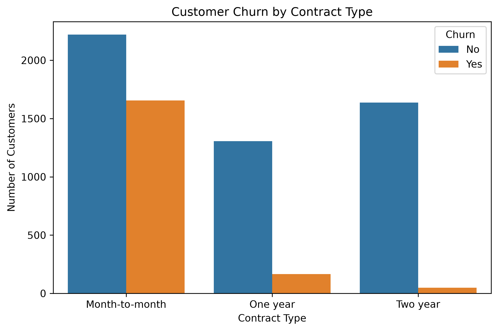
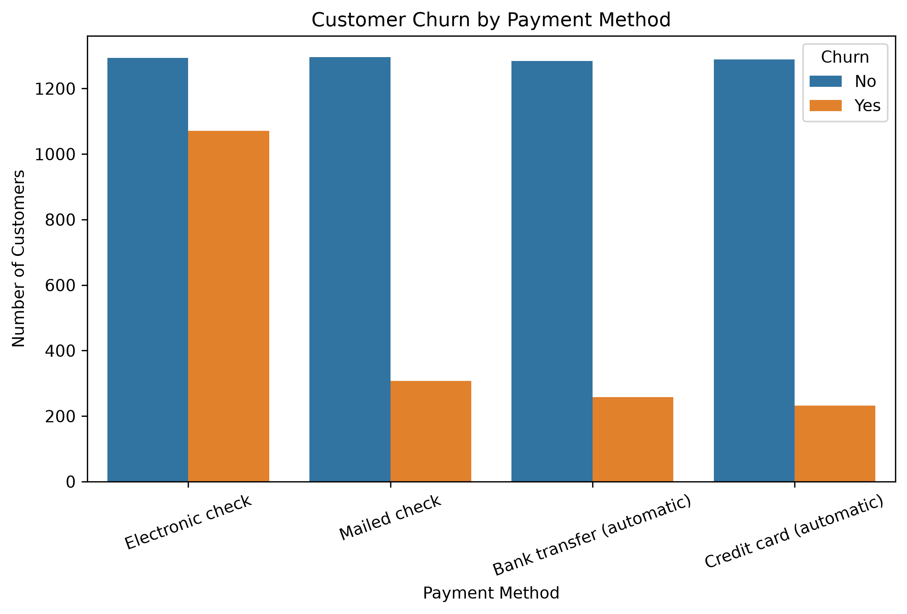
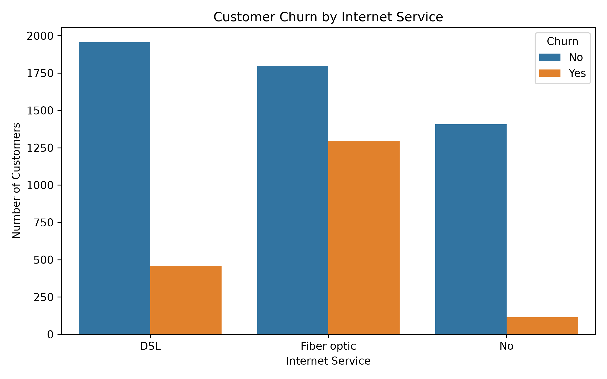
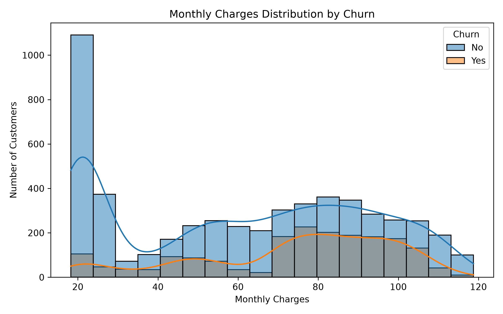
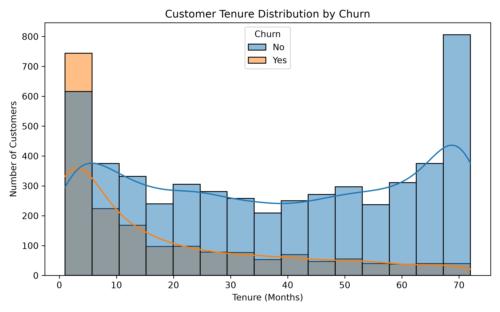

# Customer Churn Analysis

## Project Overview

This project explores customer churn using the Telco Customer Churn dataset. The analysis focuses on identifying the main factors that influence customer churn and provides business insights through data visualization.

## Dataset

- Source: Telco Customer Churn Dataset
- Total Records: 7,043 Customers
- Features: 21 Columns

## Tools Used

- Python
- Pandas
- NumPy
- Matplotlib
- Seaborn
- Jupyter Notebook

## Project Objectives

- Analyze customer churn patterns.
- Identify the factors that influence customer churn.
- Visualize customer behaviour using charts.
- Provide business insights based on the analysis.

## Key Business Insights

- Customers with month-to-month contracts have the highest churn.
- Electronic check users are more likely to churn.
- Fiber optic customers have a higher churn rate than DSL customers.
- Customers with shorter tenure are more likely to leave.
- The overall churn rate is approximately 26.6%.

## Project Structure

```text
Customer-Churn-Analysis
│
├── customer_churn_analysis.ipynb
├── README.md
├── data
│   └── WA_Fn-UseC_-Telco-Customer-Churn (1).csv
└── images
    ├── contract_churn.png
    ├── payment_method_churn.png
    ├── internet_service_churn.png
    ├── monthly_charges_distribution.png
    └── tenure_distribution.png
```

## Screenshots

### Contract Type vs Churn



### Payment Method vs Churn



### Internet Service vs Churn



### Monthly Charges Distribution



### Customer Tenure Distribution



## Conclusion

This project demonstrates the complete data analysis process, including data cleaning, exploratory data analysis (EDA), visualization, and business insight generation using Python.

The analysis identified key factors associated with customer churn, such as contract type, payment method, internet service, monthly charges, and customer tenure. These findings can help businesses develop effective customer retention strategies.
