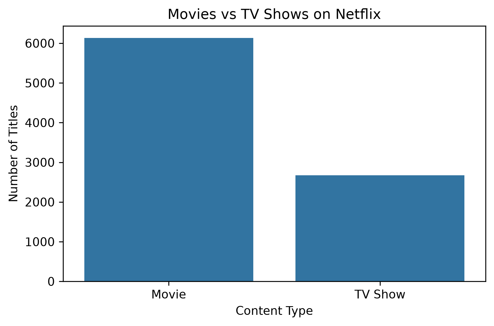
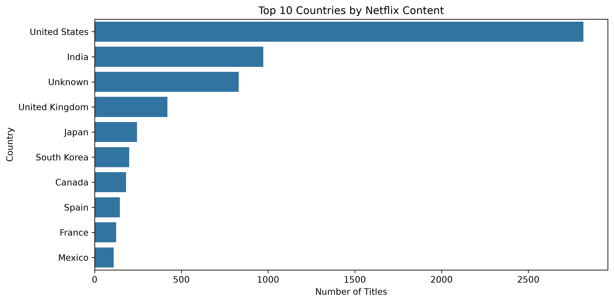
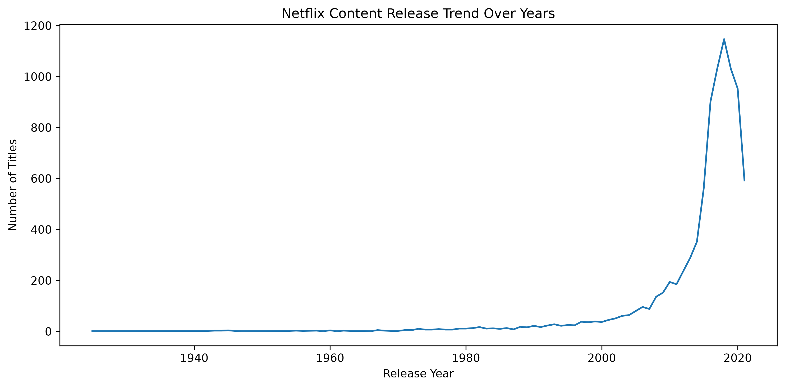
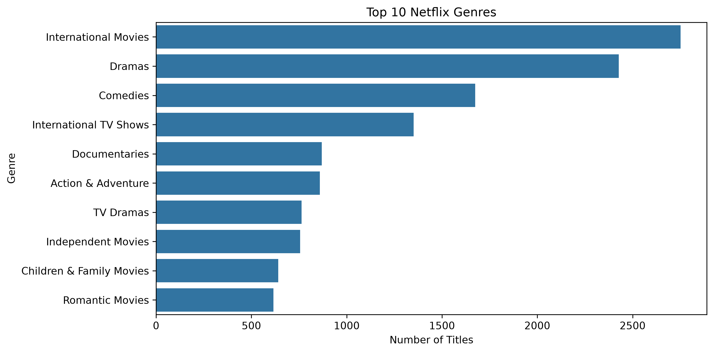
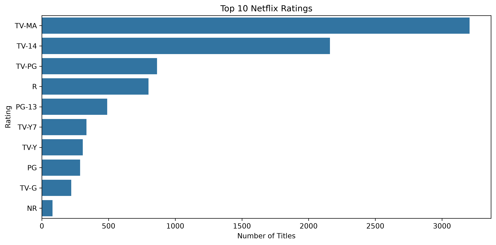

# Netflix Analysis

## Project Overview

This project analyzes Netflix content data using Python.

The goal of this project is to explore Netflix's content strategy, identify content trends, and generate business insights through data analysis and visualization.

---

## Tools & Technologies

- Python
- Pandas
- NumPy
- Matplotlib
- Seaborn
- Jupyter Notebook

---

## Dataset

**Dataset:** Netflix Titles Dataset

The dataset contains information about Netflix movies and TV shows, including:

- Title
- Type
- Country
- Release year
- Rating
- Genre
- Duration

**Dataset size:**

- 8,807 rows
- 12 columns

---

## Data Cleaning

The following data preparation steps were performed:

- Checked dataset structure and data types
- Analyzed missing values
- Filled missing categorical values with `"Unknown"`
- Checked duplicate records
- Prepared data for exploratory analysis

---

## Exploratory Data Analysis (EDA)

The analysis explored:

- Movies vs TV Shows distribution
- Top content-producing countries
- Netflix content release trends over years
- Popular genres
- Rating distribution

---

## Key Business Insights

- Movies represent approximately **69.6%** of Netflix's content catalog.
- The **United States** is the largest content producer on Netflix, followed by India and the United Kingdom.
- Netflix content production increased significantly between **2016 and 2020**, with 2018 having the highest number of releases.
- **International Movies** and **Dramas** are the most common genres on the platform.
- **TV-MA** is the most common rating category, showing Netflix's focus on mature audiences.

---

## Visualizations

### Movies vs TV Shows Distribution

---

### Top Countries by Netflix Content

---

### Netflix Content Release Trend

---

### Top Netflix Genres

---

### Top Netflix Ratings

---

## Conclusion

This project demonstrates how Python can be used for:

- Data cleaning
- Exploratory Data Analysis (EDA)
- Data visualization
- Generating business insights

The findings provide insights into Netflix's content strategy, global production trends, and audience preferences.