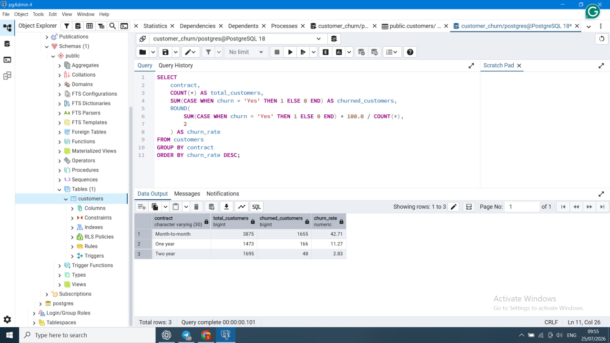
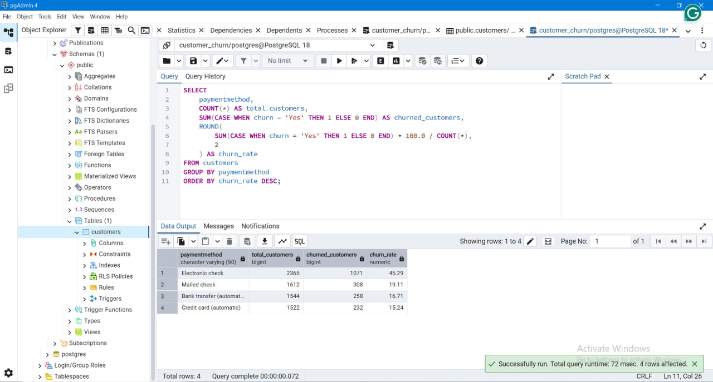
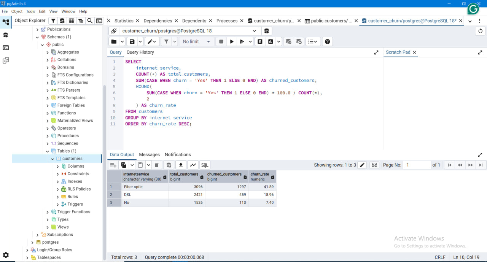

# Customer Churn Analysis (SQL)

## Project Overview

This project analyzes customer churn data to identify patterns behind customer loss and understand the factors that influence customer retention.

The main goal of this analysis is to answer important business questions:

- How many customers are leaving the company?
- Which customer groups have the highest churn rates?
- What factors are associated with customer churn?
- What actions can help improve customer retention?

This project demonstrates how SQL can be used to explore customer data, calculate churn metrics, and generate business insights that support data-driven decisions.

---

## Dataset

**Dataset:** Telco Customer Churn Dataset  
**Source:** IBM Telco Customer Churn Dataset

The dataset contains customer-level information from a telecommunications company, including:

- Customer demographics
- Service subscriptions
- Contract types
- Payment methods
- Monthly charges
- Customer tenure
- Churn status

The dataset helps analyze customer behaviour and identify potential factors that contribute to customer churn.

---

## Tools Used

- PostgreSQL
- SQL
- GitHub

---

## Analysis Performed

The analysis includes:

### Data Exploration & Quality Checks

- Total customer count analysis
- Missing value checks
- Duplicate customer identification

### Customer Churn Analysis

- Overall churn distribution
- Churn rate calculation
- Customer retention analysis

### Churn Analysis by Customer Attributes

- Contract type
- Payment method
- Internet service
- Senior citizen status
- Customer tenure
- Monthly charges
- Technical support availability
- Gender

### Customer Risk Analysis

- Identification of customer groups with higher churn risk
- Analysis of factors associated with customer retention

---

## Key Insights

### Contract Analysis

- Customers with **month-to-month contracts** have the highest churn rate (**42.71%**).
- Customers with longer-term contracts show significantly better retention, with **two-year contracts having the lowest churn rate (2.83%)**.

**Business Insight:**  
Encouraging customers to choose longer-term contracts may help reduce churn and improve customer loyalty.

---

### Payment Method Analysis

- Customers using **Electronic check** have the highest churn rate (**45.29%**).
- Customers using automatic payment methods show lower churn rates.

**Business Insight:**  
Promoting automatic payment options may improve customer retention and reduce churn risk.

---

### Internet Service Analysis

- Customers using **Fiber optic** service have a higher churn rate (**41.89%**) compared to other internet service groups.

**Business Insight:**  
The company should investigate possible reasons behind higher churn among Fiber optic customers, such as pricing, service quality, or customer experience.

---

### Customer Retention Factors

- Customers with longer tenure are generally more likely to stay with the company.
- Additional support services may contribute to higher customer satisfaction and customer retention.

---

## Project Structure

```text
Customer-Churn-Analysis
│
├── README.md
├── customer_churn_analysis.sql
└── screenshots
    ├── churn_by_contract.png
    ├── churn_by_payment.png
    └── churn_by_internet.png
```

---

## Query Results

### Churn Rate by Contract



### Churn Rate by Payment Method



### Churn Rate by Internet Service



---
## Conclusion

This project demonstrates how SQL can be used to analyze customer behaviour, identify churn patterns, and generate actionable business insights.

The findings from this analysis can help businesses understand customer risks and develop strategies to improve customer retention.
